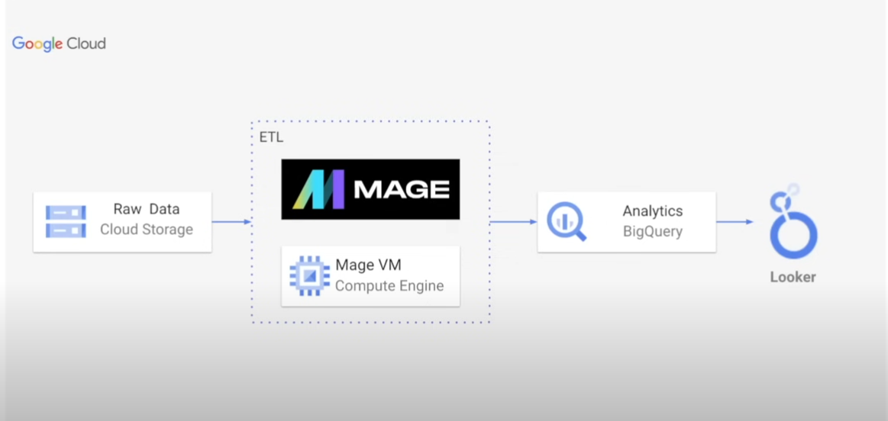

# Uber Data Analytics | Modern Data Engineering GCP Project

## Introduction
This project dives into the world of Uber data analytics using modern data engineering practices on Google Cloud Platform (GCP). We'll leverage tools like Mage.ai for building an ETL pipeline, BigQuery for data warehousing, Looker Studio for data visualization, and Cloud Storage for managing data throughout the process.

## Architecture

## Technology Used
1. Programming Language - Python
2. Scripting Language - SQL
3. Google Cloud Platform
   -  BigQuery
   -  Cloud Storage
   -  Looker Studio
   -  Compute Instance
4. Mage.AI (modern data pipeline tool)

**Modern data Pipeline Tool:** https://www.mage.ai/

**Contribute to this project here:** https://github.com/mage-ai/mage-ai

## Dataset Used
TLC Trip Record Data
Yellow and green taxi trip records include fields capturing pick-up and drop-off dates/times, pick-up and drop-off locations, trip distances, itemized fares, rate types, payment types, and driver-reported passenger counts. 

## Data Model

## Scripts for project
1. [mage transformation](mage_transformation)
2. [python transformation](python_transformation)
